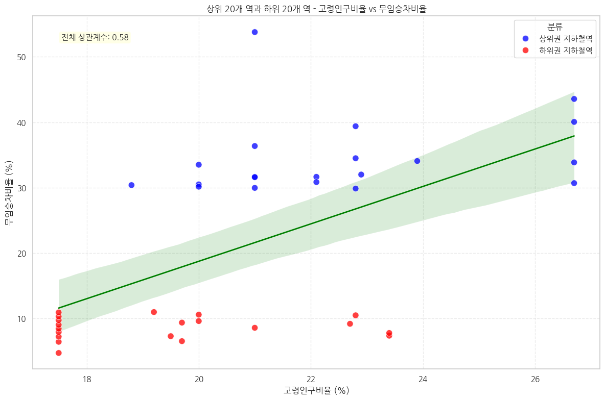
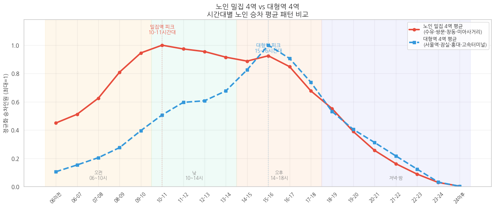
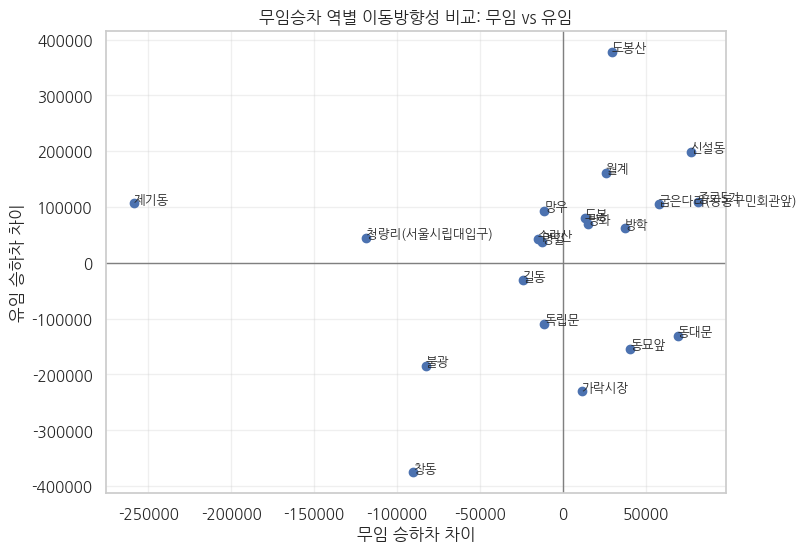

# 서울 지하철 무임승차 집중 구조와 이용 패턴 분석

> 코드잇 스프린트 데이터 분석가 16기 · 초급 프로젝트 · 4팀 **미아사거리 곱창전골** (6인)

📄 [분석 보고서](./docs/report.pdf) · 🎤 [발표자료](./docs/presentation.pdf) · 📓 [분석 노트북](./notebooks/subway_free_ride_analysis.ipynb)

## 1. 배경 및 문제 정의

서울 지하철 무임승차 이용객의 약 85%가 노인이며, 노인 이용객은 최근 5년간 51.4% 증가했습니다. 무임수송 손실이 커지면서 제도 개편 논의(예: 출퇴근 피크타임 무임승차 제한)가 이어지고 있지만, **실제 이용 행태를 근거로 한 논의**는 부족합니다.

**핵심 질문**
1. 무임승차는 어떤 역에 집중되는가?
2. 그 역들은 어떤 지역적 특성(고령인구 비율, 노인여가시설)을 가지는가?
3. 노인 이용자는 언제(요일·시간대) 지하철을 이용하는가?
4. 같은 역을 유임·무임 승객은 다르게 이용하는가?

## 2. 데이터

| 데이터 | 기간 | 출처 | 용도 |
|---|---|---|---|
| 호선별 역별 유·무임 승하차 인원 | 2025.05 ~ 2026.04 (월별) | 서울 열린데이터광장 | 역별 무임승차 비율 산출 |
| 시군구별 고령인구 비율 | 2026.04 | KOSIS 국가통계포털 | 지역 고령화와의 상관관계 |
| 서울시 경로당 정보 | 2025.06 | 서울 열린데이터광장 | 역 주변 노인여가시설 분포 |
| 역별 일별 시간대별 노인 승하차 인원 | 2025.01 ~ 2025.12 | 서울교통공사 | 요일·시간대 이용 패턴 |

자세한 컬럼 구조는 [`data/README.md`](./data/README.md) 참고

## 3. 분석 과정

**전처리**
- 데이터 누락이 많은 역(신중동·까치울·상동), 노선 기입 오류 역 제거
- 역 → 시도·자치구 매핑 (원본에 위치 정보 없음)
- 파생변수: 무임승차비율, 유/무임 승하차 차이, 환승역 여부, 시간대 5구간, 평일/주말/공휴일 구분, 역별 최대값 기준 정규화

**'무임승차 집중 역' 정의**
절대 인원 상위 10역과 비율 상위 10역이 **하나도 겹치지 않는 것**을 확인 →
① 무임승차 비율 기준 정렬 → ② 무임승차 인원 중앙값(720,400명) 이상 → ③ 서울 소재 역
3단계 필터로 상위·하위 20역을 정의

**분석**
- 고령인구 비율 × 무임승차 비율 상관분석 + Folium 지도 시각화
- 경로당 주소 지오코딩 → 역 반경 500m 내 경로당 수 집계 (GeoPandas)
- 노인 밀집 지역 4역 vs 도심 대형 4역의 시간대별 이용 패턴 비교
- 유임·무임 승하차 차이 산점도로 역 유형화 (무임 출발지형 / 목적지형)

## 4. 핵심 결과

**① 무임승차는 특정 역에 집중된다**
상위 20역의 무임승차 비율은 29.8~53.7%(제기동 53.7%), 하위 20역은 4.7~10.9%(홍대입구 4.7%)로 10배 이상 차이

**② 거주지 + 목적지 이중 구조**
- 고령인구 비율과 무임승차 비율의 상관계수 **0.58**
- 상위 20역 반경 500m 경로당 평균 **6.8개** vs 하위 20역 **2.75개** (약 2.5배)
- 단, 제기동·동묘앞·종로5가 등은 고령인구 비율이 평균 수준인데도 집중 → 목적지 기반 수요

**③ 노인 이용은 출퇴근이 아닌 '낮 시간대·평일' 중심**
- 평일 이용량이 주말보다 34% 높고, 공휴일은 주말보다도 낮음 → 여가보다 병원·은행 등 생활 이동
- 노인 밀집 지역은 오전 10~11시, 도심 대형역은 15~16시에 피크

**④ 같은 역, 다른 용도**
가락시장·동묘앞은 무임 승객의 출발지이자 유임 승객의 도착지, 제기동·망우는 그 반대

## 5. 결론 및 제언

출퇴근 피크타임 무임승차 제한은 실제 이용이 몰리는 **낮 시간대와 괴리**가 있어 효과는 제한적이고 고령층 이동 편의만 저해할 수 있습니다. 일괄 정책보다 **역의 기능과 이용 수요에 맞춘 차별화된 관리**가 필요합니다.

**한계**: 자치구 단위 고령인구 비율(역 단위 아님), 데이터셋 간 분석 기간 불일치, 경로당으로 한정된 시설 데이터, OD(출발-도착) 추적 불가

## 6. 기술 스택

`Python` `pandas` `NumPy` `Matplotlib` `Seaborn` `GeoPandas` `Shapely` `Folium` `Google Colab`
