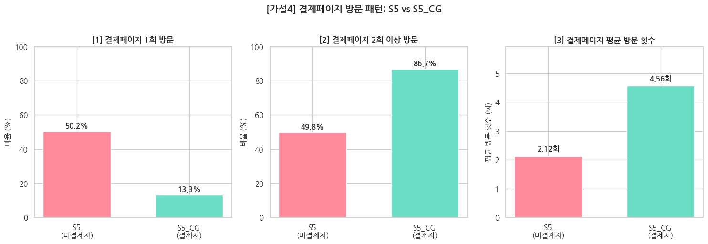
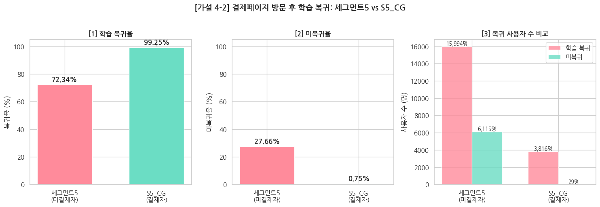

# 비결제자 행동 세분화를 통한 유료 전환 전략 제안

> **그들의 행동 병목은 어디서 발생하는가?**
> 코드잇 스프린트 데이터 분석가 16기 · 중급 프로젝트 1 · 7팀 **카피바라 클럽** (5인)

📄 [분석 보고서](./docs/report.pdf) · 🎤 [발표자료](./docs/presentation.pdf) · 📓 [분석 노트북](./notebooks/nonpaying_segment_analysis.ipynb)

## 1. 배경 및 문제 정의

온라인 학습 구독 서비스의 전체 회원 85,210명 중 **92.5%(78,788명)가 비결제자**입니다.
모수 관점에서 비결제자의 전환이 매출 성장에 결정적이라고 판단해, 비결제자를 하나의 집단이 아닌 **행동 경험에 따라 세분화**하고 세그먼트별 전환 병목을 찾는 것을 목표로 했습니다.

## 2. 데이터

- 구독 서비스 이벤트 로그 SQL 덤프 (MariaDB 복원 → 테이블별 CSV 변환)
- 원본 기간 2022.01 ~ 2023.12 → 이벤트 테이블 공통 구간 기준 **2022.12 ~ 2023.11 (12개월)** 로 확정
- 분석 대상: 회원가입 완료 회원 (비회원 식별 불가)
- 무료체험 테이블(`start_free_trial`)은 2023.04 정책 폐지로 제외

자세한 테이블 구조는 [`data/README.md`](./data/README.md) 참고

## 3. 분석 과정

**전처리**: 분석 기간 필터, user_id 결측 제거, 완전 중복 제거, 음수 할인금액 제거, 가입 이후 행동만 사용

**세그먼테이션**
콘텐츠 페이지 / 레슨 페이지 / 결제 페이지 진입 여부(O/X) 조합 8개 Case → **5개 상호배타 세그먼트**

| 세그먼트 | 정의 | 비중 |
|---|---|---|
| 미활성화층 | 가입 후 핵심 행동 없음 | 12.6% |
| 콘텐츠 탐색층 | 콘텐츠만 탐색 | 1.9% |
| 학습 경험층 | 레슨 O, 결제 페이지 X | 33.7% |
| 결제 탐색층 | 결제 페이지 O, 레슨 X | 23.7% |
| 결제 고민층 | 레슨 O, 결제 페이지 O, 미결제 | 28.1% |

**세그먼트별 가설 검증**: 각 세그먼트를 다음 단계 집단 또는 실제 결제자 비교군과 비교

> `is_trial` 컬럼이 명세와 다르게 동작하는 것을 검증(유료로 표기된 레슨의 38.3%에서 완료 기록 존재)하고 분류 기준에서 제외

## 4. 핵심 결과

**학습 경험층** — 깊이 있는 경험일수록 결제 페이지 진입률↑

| 행동 | 결제 페이지 진입률 |
|---|---|
| 콘텐츠 페이지 방문 vs 미방문 | 65.6% vs 33.3% |
| 레슨 완료 vs 미완료 | 57.5% vs 40.2% |
| 질문 기능 이용 vs 미이용 | 62.2% vs 42.4% |
| 콘텐츠 탐색 6회 이상 vs 0회 | 77.5% vs 33.3% |

**결제 탐색층** — 가입 후 **6초 만에** 결제창 직행, 68.4%가 1회 진입 후 이탈 (실제 결제자 19.2%)

**결제 고민층(세그먼트 5) vs 결제자** — 레슨 경험의 '양과 깊이'가 차이

- 고유 레슨 수 평균 10.9개 vs 21.1개, 레슨 완료율 27.0% vs 48.4%
- 결제 페이지 1회 방문 후 이탈 **50.2% vs 13.3%**
- 결제 페이지 방문 후 학습 복귀 72.3% vs 99.3%

**종합 병목**
1. 서비스 핵심 가치를 충분히 경험하기 전의 **성급한 결제 페이지 진입**
2. 결제 페이지 이탈자를 다시 데려올 **재방문 유도 장치 부재**

## 5. 개선 제안

| 개선안 | 대상 세그먼트 | 내용 |
|---|---|---|
| 관심 분야 기반 콘텐츠 추천 | 미활성화 · 콘텐츠 탐색 · 결제 탐색 | 가입 시 관심 분야 수집 → 메인 맞춤 콘텐츠 노출 |
| 학습 상태 기반 맞춤 알림 | 학습 경험 · 결제 고민 | "이어서 완료하기", 다음 레슨, 완강 후 연관 콘텐츠 |
| 결제 페이지 이탈자 재방문 유도 | 결제 탐색 · 결제 고민 | 최근 학습 분야 / 관심 분야 콘텐츠로 재유입 |

**한계**: 관찰 로그 기반이라 인과관계 단정 불가, 결제 페이지 진입 ≠ 결제 의도, 유입 경로·요금제 노출 등 정보 부재

## 6. 기술 스택

`Python` `pandas` `SQL` `MariaDB` `pandasql` `Matplotlib` `Seaborn` `Google Colab`
