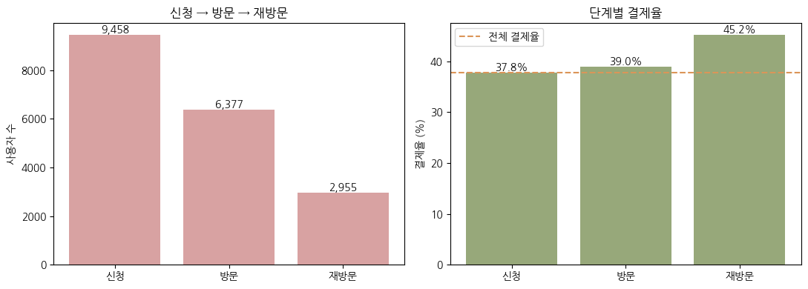
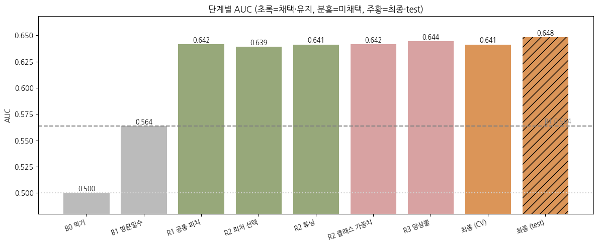
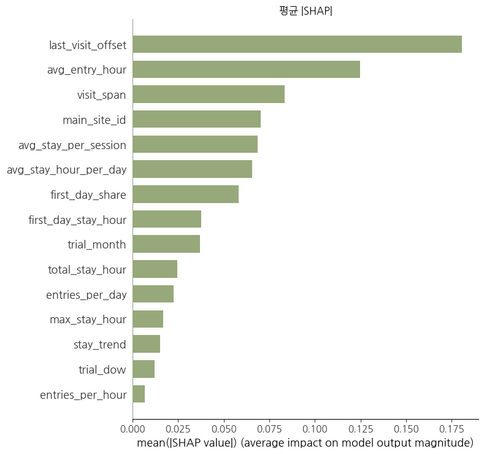

# 공유오피스 무료체험 고객의 결제 전환 예측과 서비스 개선 방향

> 코드잇 스프린트 데이터 분석가 16기 · 중급 프로젝트 2 (파트 3) · 2팀 **안2잘부** (6인) · 2026.09

📄 [분석 보고서](./docs/report.pdf) · 📓 [분석 노트북](./notebooks/shared_office_conversion_model.ipynb)

## 1. 배경 및 문제 정의

공유오피스 3일 무료체험은 잠재 고객이 공간을 경험한 뒤 유료 이용을 결정하는 전환 단계입니다.
모든 체험 고객에게 같은 수준의 응대를 하기 어렵기 때문에, **체험 중 행동으로 결제 가능성을 예측**할 수 있다면 상담·재방문 안내 같은 한정된 운영 자원을 효율적으로 배분할 수 있습니다.

**비즈니스 질문**
1. 신청자는 방문 → 재방문 → 결제로 어떻게 이동하는가?
2. 방문일수·체류시간·출입 횟수·이용 시간대·지점은 결제와 어떤 관련이 있는가?
3. 체험 중 행동으로 결제 가능성을 어느 정도 예측할 수 있는가?
4. 직접 개선할 수 있는 요인은 무엇이고, 추가로 어떤 데이터가 필요한가?

## 2. 데이터

5개 테이블 (신청 · 결제 · 방문 · 출입 로그 · 지점), 2021.05 ~ 2023.12
→ 품질 검증 후 **최종 9,458명** (방문 고객 6,377명을 예측 대상으로 사용)

자세한 테이블 구조는 [`data/README.md`](./data/README.md) 참고

## 3. 데이터 품질 검증 및 전처리

이 프로젝트에서 가장 공들인 부분입니다.

| 이슈 | 처리 |
|---|---|
| 출입 로그 타임존 | 방문 기록(KST)과 입실 피크 비교(06시 vs 13시) → UTC로 판단, +9h 보정 |
| 중복 | 완전 중복 470행 제거 / 복수 신청 7명 제외 / 부분 중복 76행 집계 |
| 입·퇴실 시각 결측 555행 | 출입 로그로 복원. 정상 행에서 먼저 검증(1분 이내 일치율 입실 93.9%, 퇴실 92.1%) 후 정합성 통과 395행만 채택 |
| 자정 넘김 방문 분리 | 23:59:59 → 00:00:00 연속 행 605건 병합 |
| 데이터 끝 절단 | 체험 기간(D0~D3)이 잘리는 신청자 27명 제외 |

→ 사용자 1명 = 1행, 36개 피처 생성 (방문 지속성, 이용시간, 시간대, 지점, 출입 빈도 등)

## 4. EDA

- 신청 → 방문 **67.4%**, 방문자 중 재방문 **46.3%** — 방문자의 54%는 하루만 이용
- 재방문 고객 결제율 **45.2%** vs 비재방문 34.4%
- 하루 평균 체류 8시간 이상 고객의 결제율이 오히려 낮음(약 30%) → 오래 머문다고 결제하지 않음
- 첫 입실 18시 이후 고객 결제율 약 50% (주간 34~39%)

## 5. 결제 전환 예측 모델링

- 지도학습 이진 분류 (`is_payment`), 학습 5,120명 / 테스트 1,257명
- **누수 방지**: Train/Test 분할을 가장 먼저 수행 → 피처 생성·변수 선택·튜닝은 학습 데이터 내부에서만, 테스트는 마지막 1회만 사용
- 변수 선택: 46개 → 준상수 제거 → 스피어만 |r| ≥ 0.8 상관 제거 → 모델별 중요도 상위 k개 CV 비교 → **15개**
- 모델 비교: Logistic Regression, Random Forest, XGBoost, LightGBM, CatBoost (+ 튜닝, 클래스 가중치, 앙상블)
- 임계값: OOF 예측 기반, 결제 예상 비율 50% 이하 제약에서 F1 최대

| 지표 | 결과 |
|---|---|
| 방문일수 기준선 Test ROC-AUC | 0.591 |
| **CatBoost Test ROC-AUC** | **0.648** (CV 0.641) |
| 임계값 | 0.366 |
| Precision / Recall / F1 | 0.501 / 0.665 / 0.571 |

**모델 해석 (SHAP + Permutation Importance)**

| 변수 | 방향 |
|---|---|
| 마지막 방문 시점 | 늦을수록 결제 확률↑ |
| 방문 기간 폭 | 넓을수록 ↑ |
| 평균 입실 시각 | 늦을수록 ↑ |
| 첫날 이용 집중도 | 높을수록 ↓ |

## 6. 비즈니스 제안

| 액션 | 근거 |
|---|---|
| A. 첫 방문 후 재방문 유도 (남은 체험 기간·미방문 지점 안내) | 마지막 방문일·방문 기간이 핵심 신호 |
| B. 저녁 이용 고객 맞춤 상품·야간 상담 | 평균 입실 시각이 늦을수록 결제 확률↑ |
| C. 예측확률 기반 상담 우선순위 (고/중/저 전환 가능군) | 결제 예상 집단의 실제 결제율 50.1% (전체 39.5%의 1.27배) |

A안을 우선 실험으로 하는 **A/B 테스트 설계**(대상·배정·중간지표·비용·성공 기준) 포함

**한계**: 결제 시각 부재로 선후관계 확인 불가(사후 분류 모델), 고객 배경·가격 정보 없음, 시간순 검증 미수행

## 7. 내 역할 (원예은)

<!-- TODO: 맡은 부분 작성 -->
- 

## 8. 기술 스택

`Python` `pandas` `scikit-learn` `CatBoost` `XGBoost` `LightGBM` `SHAP` `SciPy` `Matplotlib` `Seaborn` `Google Colab`
